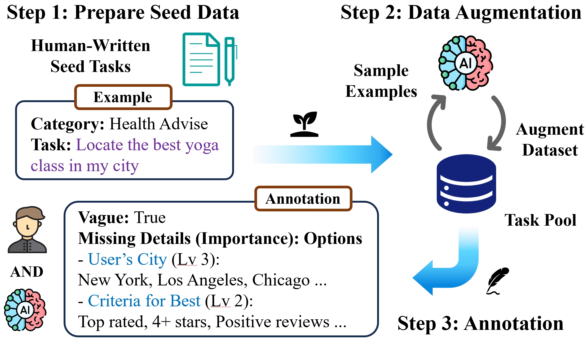
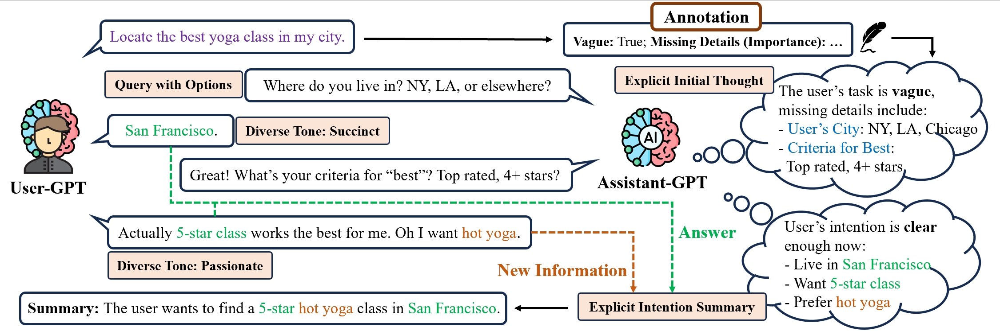
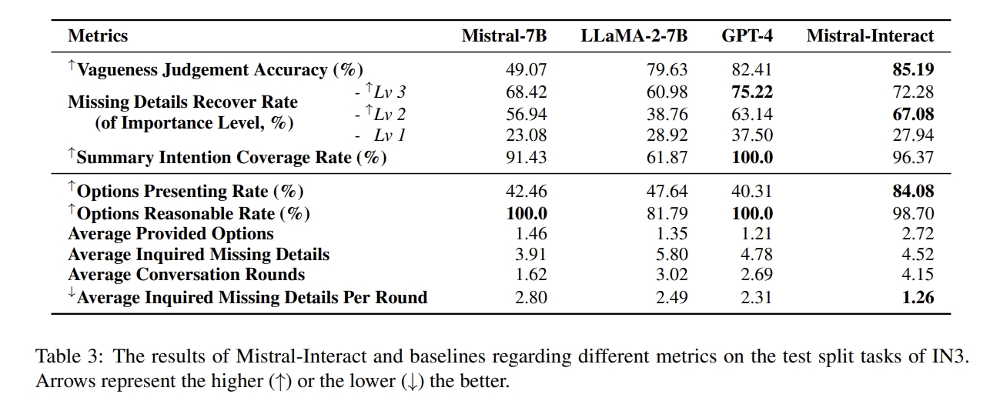
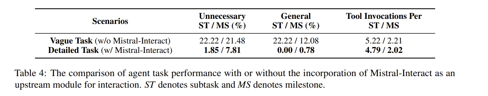
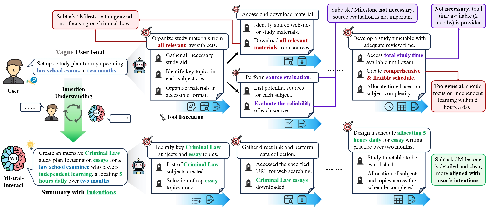

<div align="center">
    <h1>   Tell Me More!</h1>
</div>

<p align="center">
  <a target="_blank">
    
  </a>
  <a target="_blank">
    
  </a>
</p>

<p align="center">
  <a href="#features">Features</a> •
  <a href="#training">Training</a> •
  <a href="#Evaluation">Evaluation</a> •
  <a href="#Citation">Citation</a>
</p>

The repo is for the implementation and evaluation of Mistral-Interact, a powerful model that proactively assesses task vagueness, inquires user intentions, and refines them into actionable goals before starting downstream agent task execution.

Source codes and datasets for **[Tell Me More! Towards Implicit User Intention Understanding of Language Model Driven Agents](https://arxiv.org/abs/2402.09205)**. We release Intention-in-Interaction (IN3) benchmark and develop Mistral-Interact, capable of discerning vague instructions and recovering missing details.

## ✨ Features

Mistral-Interact has the following features:

- **Better understanding of user judgments:** Among all the open-source models, Mistral-Interact is the best at predicting task vagueness and missing details that users regard as necessary.
- **Comprehensive summarization of user intentions:** Mistral-Interact is effective in making an explicit and comprehensive summary based on detailed user intentions.

- **Enhanced model-user interaction experience:** Mistral-Interact inquires about missing details in vague tasks more reasonably and friendly than other open-source models, thus promoting a clearer understanding of the user’s implicit intentions.

- **Comparable performance with closed-source GPT-4:** We prove that smaller-scale model experts can approach or even exceed general-purpose large-scale models across various aspects including vagueness judgment, comprehensiveness of summaries, and friendliness of interaction.

<div><a id="Introduction"></a></div>

## 📖 Introduction

### Intention-in-Interaction (IN3) benchmark

Current agent benchmarks usually assume the clearance of given tasks and exclude user intention understanding as an important aspect for evaluation. Given this ignorance in assessment, we formulate Intention-in-Interaction (IN3), a benchmark aiming to test the agent’s interaction ability through explicit task vagueness judgment and user intention understanding.

**It is located in the [data/IN3](https://github.com/HBX-hbx/Mistral-Interact/tree/master/data/IN3) directory.** You can also download it from [here](https://huggingface.co/datasets/hbx/IN3).

<div align="center">
    
    <br/>
    <figcaption><b>Figure 1: Construction of IN3.</b></figcaption>
</div>


As illustrated in the figure above , with human-written seed tasks (**Step 1**), the model iteratively generates new tasks to augment the dataset, while sampling demonstrations from the dataset as new examples for itself to perform the next round of generation (**Step 2**). We perform human annotation of each task’s vagueness, missing details, and each detail’s importance level and potential options with the help of GPT-4 (**Step 3**). GPT-4 will first suggest the task’s vagueness and potential missing details with options and importance level, while human annotators take them as references and adapt them with their own perspectives and intentions.

### Mistral-Interact

- We apply training split tasks in IN3 to construct simulated model-user conversation records that provide explicit initial thoughts, rounds of queries with options, summarization of implicit intentions, and diverse user response tones. 
- Training on these conversations, we adapt [Mistral-7B](https://huggingface.co/mistralai/Mistral-7B-v0.1) into **Mistral-Interact**, a powerful and robust variant capable of judging the vagueness of user instruction, actively querying for missing details with suggestions, and explicitly summarizing the detailed and clear user intentions.

<div><a id="Training"></a></div>

## 🛠️ Training

### Construction of Training Data

- As IN3 has already provided diverse agent tasks with annotations, we apply its training split to construct the conversation records for training. 

- We employ two GPT-4s to simulate the conversation, with one imitating the user aiming to complete a certain task (**User-GPT**), and the other as an assistant aiming to clearly understand user intentions with the annotations from IN3 as help (**Assistant-GPT**).

**It is located in the [data/interactions](https://github.com/HBX-hbx/Mistral-Interact/tree/master/data/interactions) directory.** You can also download it from [here](https://huggingface.co/datasets/hbx/IN3-interaction).

<div align="center">
    
    <br/>
    <figcaption><b>Figure 2: Construction of training data.</b></figcaption>
</div>


With IN3's annotations regarding task vagueness, missing details, and potential options, we apply several strategies during the construction of conversation records to better inspire the target model's robust inquiry and reasoning ability.

- Explicit Initial Thought
- Query with Options
- Diverse User Tones
- Explicit Intention Summary

### Usage

We utilize the [model-center](https://github.com/OpenBMB/ModelCenter) framework to conduct full-parameter fine-tuning of Mistral-7B on two 80GB A800s. Specific hyper-parameters can be tuned in [scripts/sft.sh](https://github.com/HBX-hbx/Mistral-Interact/blob/master/scripts/sft.sh). Here are some parameters need to check:

- `model_name_or_path`: Path to the Mistral-7B-v0.1 base model weights. Note that the weights should be transformed from huggingface weight to bmtrain weight using the script provided **[here](https://github.com/OpenBMB/ModelCenter/blob/main/transfer/hugLLaMa2_bmtrainLLaMa2.py).**
- `data_dir`: Path to the training data with conversation records.
- `save_dir`: Path to the saved checkpoints.

Just run the script in the root of repo to start training:

```shell
bash scripts/sft.sh
```

<div><a id="Evaluation"></a></div>

## 🎮 Inference

Download **Mistral-Interact** [here](https://huggingface.co/hbx/Mistral-Interact), and put it under `./models`. The model weights downloaded from huggingface is the format of huggingface. For inference, we need to convert the format from huggingface to model-center using [src/hf_2_mc.py](https://github.com/HBX-hbx/Mistral-Interact/blob/master/src/hf_2_mc.py).

Then run the following script in the root of repo to start inferencing:

```shell
bash scripts/test_one_new.sh
```


## 📊 Evaluation

An agent's intention understanding capability can be assessed directly through user interaction and indirectly through downstream task execution.

### Instruction Understanding

Instruction understanding does not involve any real-time agent execution, so we directly evaluate the language models themselves during interaction to judge their capability to serve as a robust upstream module in agent design.

#### Metrics

- **Vagueness Judgment Accuracy**: We calculate the percent of the model’s judgments of task t’s vagueness (vague or clear) that are aligned with ground truth.
- **Missing Details Recover Rate**: For ground truth missing details of different importance levels, we analyze what percent are recovered (explicitly inquired) by the model during the interaction.
- **Summary Intention Coverage Rate**: The percent of user-provided intentions that are explicitly summarized finally in summary by the model. 
- **Options Presenting Rate**: For all the missing details explicitly queried by the model, we analyze the percent of them accompanied by potential options.
- **Options Reasonable Rate**: For options provided by the model, we record the percent of them that the user believes is reasonable to propose.
- **Average Provided Options**: Average number of options the model provides for one missing detail during the inquiry.
- **Average Inquired Missing Details**: Average number of missing details the model inquires for one task.
- **Average Conversation Rounds**: Average number of conversation rounds that the model has with the user for one task.
- **Average Inquired Missing Details Per Round**: Average number of missing details the model inquires for one round of conversation.

#### Usage

We use the [test split](https://github.com/HBX-hbx/Mistral-Interact/blob/master/data/IN3/test.jsonl) of IN3 agent tasks for evaluation. Conversation records based on **Mistral-Interact**, **LLaMA-2-7B-Chat**, **Mistral-7B-Instruct-v0.2**, and **GPT-4** are located in **[here](https://github.com/HBX-hbx/Mistral-Interact/tree/master/data/user_interaction_records)**.

- Firstly, we split the inquiry from Assistant into separate queries and options with the help of GPT-4. (Do not forget to add your API key in **src/utils.py**).

  ```python
  python src/split_query_options.py
  ```

- Then, we run the following code to calculate various statistics for each model.

  ```python
  python src/stats.py
  ```

- Finally merge the results.

  ```python
  python src/merge.py
  ```

#### Results

<center>
  <figure>
    
  </figure>
</center>


### Instruction Execution

To evaluate the effectiveness of the implicit intention understanding for instruction execution, we integrate Mistral-Interact as an upstream interaction module into the [XAgent](https://github.com/OpenBMB/XAgent) framework, an autonomous agent system for complex task solving.

#### Metrics

- **Unnecessary Subtasks / Milestones**: The percent of subtasks or milestones that are regarded as unnecessary by the user under the detailed task goal with clear user intentions.
- **General Subtasks / Milestones**: The percent of subtasks or milestones that are too general, instead of focusing on the user's specific intentions.
- **Tool Invocations Per Subtask / Milestone**: The average number of tool invocations for one subtask or milestone, which reflects the efficiency of agent execution.

#### Results

<center>
  <figure>
    
  </figure>
</center>


#### Case Study

<div align="center">
    
    <br/>
    <figcaption><b>Figure 3: Case study on the agent execution process.</b></figcaption>
</div>

<div><a id="Contributions"></a></div>

## 🌟Contributions

- We formulate a new research question regarding the enhancement of user-agent interaction through robust intention understanding, and release the IN3 benchmark that focuses on user participation within current agent designs.
- We propose to integrate an expert specialized in interaction as an upstream design before task execution in the agent system, and empirically adapt Mistral-Interact, shifting the focus from complex agent design to smaller-scale usercentric module design.
- We create a set of new metrics regarding the evaluation of user-agent interaction, which takes into consideration both the quantifiability of results and alignment to user preferences for future benchmarks to follow.
- We prove the viability of our method through comprehensive experiments and case studies on the XAgent framework, thereby promoting a new mechanism and paradigm of user-agent interaction in agent designs.

<div><a id="Citation"></a></div>

## Citation

Feel free to cite our paper if you find it is useful.

```bibtex
@article{cheng2024tell,
  title={Tell Me More! Towards Implicit User Intention Understanding of Language Model Driven Agents},
  author={Cheng Qian, Bingxiang He, Zhong Zhuang, Jia Deng, Yujia Qin, Xin Cong, Zhong Zhang, Jie Zhou, Yankai Lin, Zhiyuan Liu, Maosong Sun},
  journal={arXiv preprint arXiv:2402.09205},
  year={2024}
}
```

